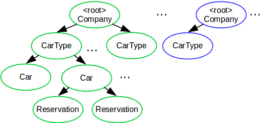

# Google App Engine - Assignment 1
### Team
- Jakub Adam
- Matteo Di Pirro

## Question 1
To explain why we rely on JPA transaction is worthy to explain on data model which is possible see on the picture below. We use a four-level tree with a CarRentalCompany as a root. This objects contains explicit references to zero or more CarTypes, containing references to Cars belonging to that car type. Also each car entity contains references to zero or more reservations booked for concrete car.

This means that every CarRentalCompany is the root of an different entity group (different colors in picture). Hence, supposing a service with 32 registered car rental companies, the application will have to deal with 32 entity groups. However, cross-group transactions operate on a maximum of 25 entity groups. Since they cannot achieve a complete consistency and they come with a higher latency, we prefer JPA transactions. We decided to solve the conformation of quotes at application level. Appllication confirm all quotes related to concrete car rental company in one transaction. If any of these transaction will failed, application delete all previous successfully created reservation from datastore. It is possible that we will need to set up a lot of transactions (in the worst case 32), but we don't think that is a problem since we don't expect many reservations to be confirmed at the same time.

## Question 2
In such a scenario, user profiles are totally independent on car reservations and they will belong to separate entity groups. Furthermore, a user profile does not have any relationships with other profile, since information referring to a certain user is completely unrelated to other users. Hence, there is no need for cross-group transactions. Not only they would be useless, but they would slow down the application due to their higher latency. This is the reason why we would apply JPA transactions even in this scenario.

## Question 3
Relying on cross-group transactions only is a drawback for concurrent accesses. When a request tries to confirm quotes, no other request is allowed to operate on the same entity groups for consistency reasons. This is an important limitation in a large-scale cloud application, since the latency will be higher and the responsiveness lower. On the other hand, with JPA transactions, we optimistically believe that everything will be ok, and we manually rollback only if something fails. This comes with the underlying assumption that a **concurrent** confirmation on the same entity group is unlikely. This requires additional time, but, if that assumption is true, the responsiveness will be **normally** higher than with cross-group transactions. 

This can be easily linked with the increasing popularuty on NoSQL databases. One of them is MongoDB, which does not provide consistency guarantees and requires the application to detect wrong situations and to rollback if that is the case. The performance is generally better, even if the application code has to deal explicitly with possible erroneous situations.